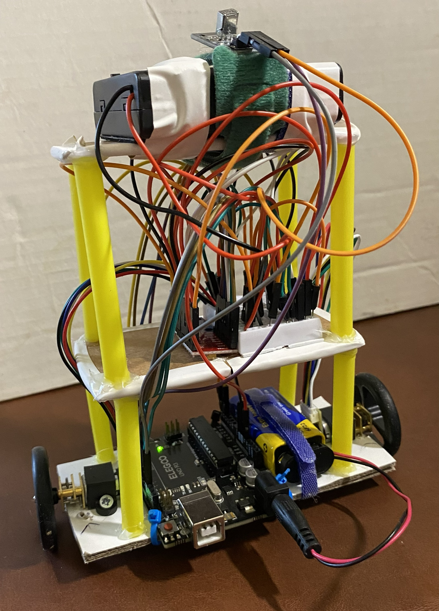
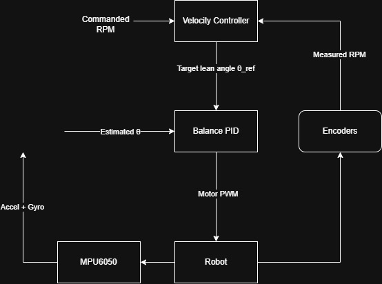
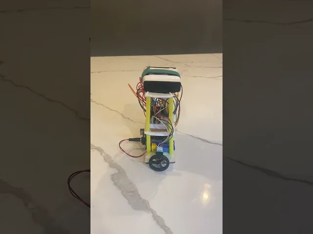
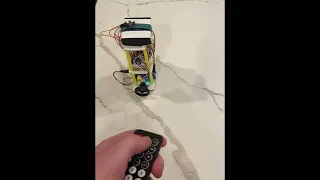

# Self-Balancing Robot

I designed and built this two-wheel self-balancing robot to explore feedback control, sensor fusion, and embedded systems using an Arduino Uno, MPU6050 IMU, encoder-equipped DC motors, and cascaded feedback control.

  

## Overview

The robot estimates its tilt angle using accelerometer and gyroscope data from an MPU6050 combined with a complementary filter. An inner PID controller continuously adjusts motor output to maintain balance.

Encoder feedback is used in an outer velocity-control loop that modifies the desired balance angle. This allows the robot to recover from disturbances and perform controlled forward and backward motion. An IR remote provides forward, reverse, and stop commands.

## Features

- Sustained hands-off self-balancing
- Recovery from forward and backward disturbances
- Encoder-based wheel-speed feedback
- IR-controlled forward, reverse, and stop commands
- Complementary-filter sensor fusion
- Cascaded balance and velocity control

## Hardware

| Component | Role |
|---|---|
| Arduino Uno R3 | Runs the control algorithm and handles sensor, encoder, motor, and IR interfaces |
| MPU6050 IMU (GY-521) | Measures acceleration and angular velocity for pitch estimation |
| TB6612FNG motor driver | Drives both DC motors using PWM commands from the Arduino |
| Two 6 V N20 gearmotors with encoders | Provide wheel motion and wheel-speed feedback |
| 40 mm wheels | Robot drive wheels |
| IR receiver and remote | Provides forward, reverse, and stop commands |
| 4×AA battery pack | Supplies the motors |
| 9 V battery | Powers the Arduino and control electronics |

The first version of the robot used a plywood chassis and weighed 790 g. This proved too heavy for the motors to handle effectively, so a significantly lighter second version was built from cardboard and drinking straws. The final chassis weighs 305 g.

## Control Architecture

The controller uses two cascaded feedback loops:

1. **Inner balance loop:** A PID controller regulates the robot's pitch angle using the filtered MPU6050 measurement.
2. **Outer velocity loop:** The wheel encoders measure how fast the robot is moving. If the measured speed differs from the commanded speed, the outer loop slightly changes the robot's target lean angle. The inner PID controller then causes the robot to lean and drive in the required direction until the speed error is reduced.

This allows the balance controller to stabilize the robot while the velocity controller independently determines whether it should remain stationary or move forward or backward.

  

## Orientation Estimation

The MPU6050 provides measurements from both a gyroscope and an accelerometer. For the robot's pitch axis, the gyroscope measures angular velocity, $\omega_g$. Integrating this angular velocity over a small time interval gives an estimate of the change in angle:

$$
\theta_g[k] = \theta[k-1] + \omega_g \Delta t
$$

The gyroscope responds quickly to changes in orientation, making it useful for short-term angle estimation. However, even a small measurement bias or amount of noise accumulates during integration, causing the estimated angle to drift over time.

The accelerometer provides a second estimate of the robot's orientation. In the coordinate system used by the robot, the pitch angle is calculated as

$$
\theta_a = \operatorname{atan2}(a_y,-a_z)
$$

When the robot is stationary, the accelerometer primarily measures the direction of gravity. This provides an absolute reference for the robot's tilt and does not suffer from the long-term drift associated with gyroscope integration.

The disadvantage is that the accelerometer cannot distinguish gravity from acceleration caused by the robot's own movement. During forward or backward acceleration, the measured acceleration vector is temporarily different from the gravity vector alone, making the accelerometer estimate less reliable over short time intervals.

A complementary filter combines the advantages of both sensors:

$$
\theta[k] =
\alpha\left(\theta[k-1] + \omega_g\Delta t\right)
+ (1-\alpha)\theta_a
$$

where

$$
\alpha = \frac{\tau}{\tau+\Delta t}
$$

The gyroscope therefore dominates short-term changes in the angle estimate, while the accelerometer gradually corrects long-term gyroscope drift.

The final robot uses a complementary-filter time constant of

$$
\tau = 2\text{ s}
$$

## Balance PID Controller

The inner balance controller compares the estimated pitch angle with the desired balance angle:

$$
e(t)=\theta(t)-\theta_{\mathrm{ref}}(t)
$$

The motor command is then calculated using proportional, integral, and derivative feedback:

$$
u(t)
=
K_Pe(t)
+
K_I\int e(t)\,dt
+
K_D\omega(t)
$$

where $u(t)$ determines the magnitude and direction of the motor PWM command.

- **Proportional control** produces a correction based on the current tilt error. A larger deviation from the target angle produces a stronger motor response.
- **Integral control** accumulates persistent error over time and helps compensate for small steady-state biases.
- **Derivative control** uses the measured angular velocity to provide damping and reduce rapid oscillation around the balance point.

The derivative term uses the gyroscope's angular-rate measurement directly rather than numerically differentiating the measured angle.

## Velocity Controller

The wheel encoders provide an estimate of the robot's forward and backward speed. The outer controller compares this measured speed with the commanded speed.

Instead of directly changing the motor PWM, the velocity controller modifies the target lean angle, $\theta_{\mathrm{ref}}$, used by the balance controller.

For example, if the commanded speed is forward but the robot is moving too slowly, the velocity controller shifts the target angle slightly forward. The balance PID controller responds by driving the wheels forward in order to keep the robot balanced at the shifted reference angle.

As the measured velocity approaches the commanded velocity, the required angle correction becomes smaller.

## Controller Tuning

PID tuning was performed experimentally.

The proportional gain was first increased until the motors responded strongly enough to prevent the robot from simply falling. Excessive proportional gain caused fast oscillation around the balance point, so derivative feedback was used to provide damping and reduce these oscillations.

The equilibrium angle, $\theta_{\mathrm{ref}}$, also required experimental adjustment. Because the robot's mass distribution and IMU mounting were not perfectly symmetric, the physical balance point was slightly offset from $0^\circ$. Small changes to this reference had a noticeable effect on whether the robot tended to drift forward or backward.

Integral action was then used to correct remaining persistent error. Tuning consisted of repeated short balance tests, observing the direction and frequency of the robot's motion, and changing one parameter at a time.

Once the inner PID loop could reliably balance the robot, the encoder-based velocity loop was added with relatively little additional tuning.

## Results

The final robot is able to:

- Balance independently without physical support
- Recover from moderate forward and backward disturbances
- Use encoder feedback to reduce unwanted translational motion
- Respond to IR commands for forward motion, reverse motion, and stopping
- Maintain balance while transitioning between stationary and commanded motion

The complete Arduino firmware is available in [`Firmware/self_balancing_robot.ino`](Firmware/self_balancing_robot.ino).

## Demo

### Balance and Disturbance Recovery

### Forward and Reverse Control

